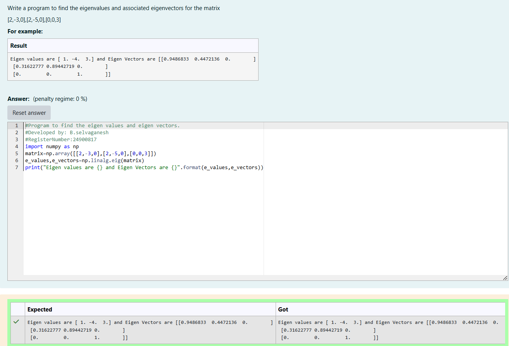

# EIGENVALUES-AND-EIGENVECTORS
## Aim:
To write a python program to find the Eigenvalues and Eigen Vectors
## Equipment’s required:
1. 	Hardware – PCs
2. 	Anaconda – Python 3.7 Installation / Moodle-Code Runner
## Algorithm:
### Step1 : Definr matrix
### Step 2: Using the np.linalg.eig(),we get two results (first is eigenvalue and scond is eigenvector) of the matrix
### Step 3: Using the np.linalg.eig(),  we get two results (first is eigenvalue and second is eigenvector) of the given matrix.
### Step 4: print the eigenvalue and eigenvector

## Program:
```

#Program to find the eigen values and eigen vectors.
#Developed by: B.selvaganesh
#RegisterNumber:24900817
import numpy as np
matrix=np.array([[2,-3,0],[2,-5,0],[0,0,3]])
e_values,e_vectors=np.linalg.eig(matrix)
print("Eigen values are {} and Eigen Vectors are {}".format(e_values,e_vectors))

```


## Output:

## Result:
Thus the Eigenvalue and Eigenvector is successfully solved using python program
